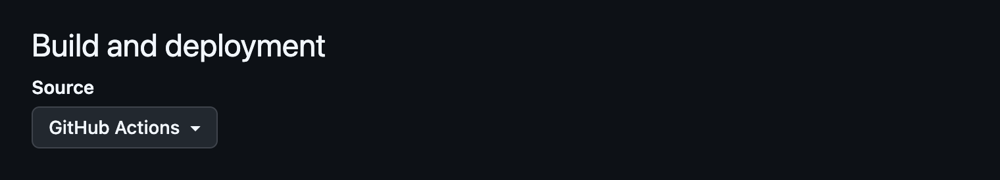

# datannur-template

<!-- Point the badge at your own repository: replace datannur/datannur-template -->
[](https://github.com/datannur/datannur-template/actions/workflows/build.yml)

Get your own data catalog online in 5 minutes — no server, no database, no local install.

This template publishes a [datannur](https://datannur.com) catalog on GitHub Pages. Point at open data URLs or drop files in a folder: every commit rebuilds and republishes the catalog — variables, types, statistics, previews and maps are extracted automatically.

**[Live demo](https://datannur.com/demo)** · [datannur.com](https://datannur.com) · [Documentation](https://docs.datannur.com/builder/) · [Main repository](https://github.com/datannur/datannur)

## Quick start

1. Click **Use this template** → **Create a new repository** (public).
2. In your new repository: **Settings → Pages → Source: GitHub Actions**.

   

3. Edit a file or upload your own data (see below). Each commit triggers a build.
4. After ~2 minutes, your catalog is live at `https://<account>.github.io/<repository>/`.

> **Forked instead of using the template?** GitHub disables workflows on forks by default: open the **Actions** tab and click **I understand my workflows, go ahead and enable them** first.

## Three ways to use it

**1. Point at public URLs in [catalog.yml](catalog.yml)** — any open data file already online (data portals, GitHub, Zenodo…) is scanned in place: variables, types, row counts, statistics, preview, and a map for geographic files. Name, description and links live right next to the URL — one file describes your whole catalog.

**2. Drop data files in `datasets/`** — every file is scanned automatically the same way. CSV, Excel, JSON, Parquet, GeoJSON, Shapefile, and [more](https://docs.datannur.com/builder/scanning-files). Metadata already embedded in your files is picked up too: Parquet dataset and column descriptions (see the example file), SAS/SPSS/Stata labels, database comments. Use **Add file → Upload files** directly in the GitHub web UI.

**3. Scale up with metadata files (optional)** — when inline YAML gets crowded, or when non-developers curate in Excel, move descriptions to CSV metadata files (see below).

## Editing metadata (optional)

For small catalogs, the inline `metadata:` blocks in [catalog.yml](catalog.yml) are all you need. To go further, create a `metadata/` folder and uncomment `metadata_path: ./metadata` in catalog.yml. There you can:

- **Enrich scanned datasets** with a `dataset.csv` (descriptions, tags, better names) or a `variable.csv` — manual values override scanned ones.
- **Reference external datasets** that have no file at all: a row with just a name, a description and a link.
- **Edit in a spreadsheet**: download the CSV, edit it in Excel/LibreOffice, re-upload it. The same files are also accepted as `.xlsx` or `.json`.

Entity files follow the [datannur schemas](https://github.com/datannur/datannur/tree/main/package/app/schemas): `dataset.csv`, `variable.csv`, `tag.csv`, `organization.csv`, `concept.csv`… See the [metadata documentation](https://docs.datannur.com/builder/metadata) for all columns.

**How to reference a scanned file**: its id is derived from its path — `datasets/swiss_cantons.csv` becomes `datasets---swiss_cantons_csv`, and its columns `datasets---swiss_cantons_csv---<column>`. Copy the id from the dataset page in your published catalog.

If the configuration or a metadata file is invalid, the build fails with a readable error in the **Actions** tab and the previous catalog stays online. Pull requests run the same build as a validation check, without deploying — the **Actions** tab also shows a build summary for every run.

## ⚠️ Public repository = public data

Everything you commit to a public repository is public, including the files in `datasets/`. For internal or sensitive data, run datannur locally instead: a local folder plus [datannurpy](https://docs.datannur.com/builder/) produces the same catalog without publishing anything.

## Preview locally (optional)

You never need a local install — but if you want to preview changes before committing:

```bash
pip install "datannurpy[geo,stat]>=0.29.3"
python -m datannurpy catalog.yml
# then open catalog/index.html in your browser
```

## What's in this template

```
├── catalog.yml                     # your catalog: config + datasets + descriptions
├── datasets/                       # your data files (scanned automatically)
│   ├── swiss_cantons.csv           # example — delete it whenever you want
│   └── swiss_unemployment.parquet  # example with embedded dataset + column descriptions
└── .github/workflows/build.yml     # build & deploy to GitHub Pages
```

Delete the example files and URLs whenever you want — the next commit rebuilds the catalog from what's left.
